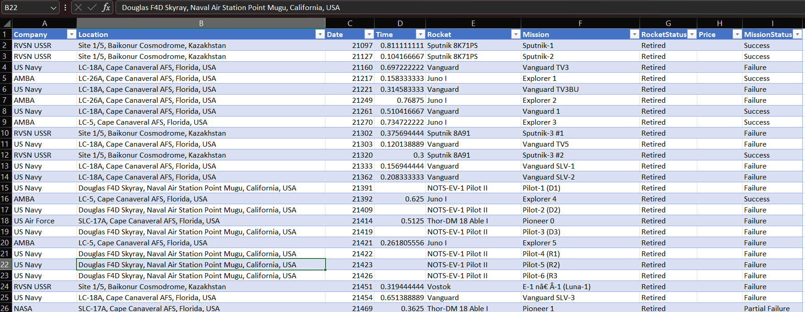
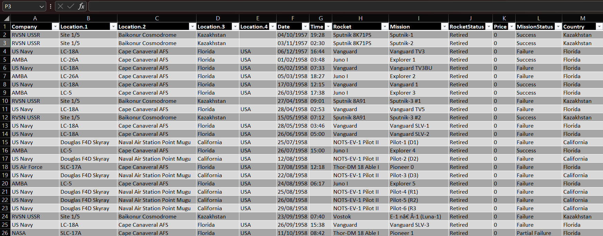

# 🚀 Space Mission Analysis Dashboard (Power BI)

## 📋 Project Overview
This project analyzes global space missions using an interactive **Power BI dashboard** to uncover trends in rocket launches, mission success rates, and country-level activity. By transforming raw historical data into visual insights, this analysis highlights the evolution and reliability of the global space industry.

---

## 🛠️ Data Transformation (The ETL Process)
The raw dataset required significant preparation before it could be used for visualization. Below is a comparison of the data **before** and **after** the cleaning process in Power Query.

### 🔍 Data Cleaning: Before vs. After
| Before Cleaning |
|  |
| After Cleaning |
| |

**Key Challenges & Solutions:**
* **Messy Location Strings:** Launch sites were stored as single strings (Site, Base, State, Country). I used **Split Column by Delimiter** in Power Query to isolate the **Country** for geographical analysis.
* **Invalid Date Formats:** Raw dates were stored as serial integers (e.g., 21097). I transformed these into a standard **DD/MM/YYYY** format to enable time-series trends.
* **Time Serialization:** Mission times were recorded as decimal values (e.g., 0.811). I converted these into a proper **HH:MM** time format (19:28).
* **Data Imputation:** Standardized the `Price` column by handling null values and converting them to a currency data type to maintain model integrity.

---

## 📊 Dashboard Insights
### 

### 1️⃣ Rocket Launch Over Time
* **Insight:** Launch activity surged during the 1960s Space Race, peaked again in the early 1970s (1973 saw **96 successes**), and is currently experiencing a modern "Renaissance" driven by private space companies.

### 2️⃣ Mission Outcome Distribution
* **Metric:** Approximately **89.89% (4.16K)** of all recorded missions were successful.
* **Analysis:** The high success rate reflects massive improvements in aerospace engineering, though the **7.71% failure rate** highlights the inherent risks of space exploration.

### 3️⃣ Reliability & Leadership
* **Most Used Rocket:** The **Cosmos-3M** leads with **446 launches**, demonstrating incredible long-term operational reliability.
* **Top Countries:** While the **USA and Russia** dominate historical totals, **China** shows the most aggressive growth in successful missions in recent decades.

---

## ⚙️ Technical Implementation (DAX)
I developed custom measures to ensure the dashboard reflects accurate percentages and counts:

**Success Rate %:**
```dax
Success Rate = 
DIVIDE(
    CALCULATE(COUNTROWS('Space Missions'), 'Space Missions'[MissionStatus] = "Success"),
    COUNTROWS('Space Missions'),
    0
)
