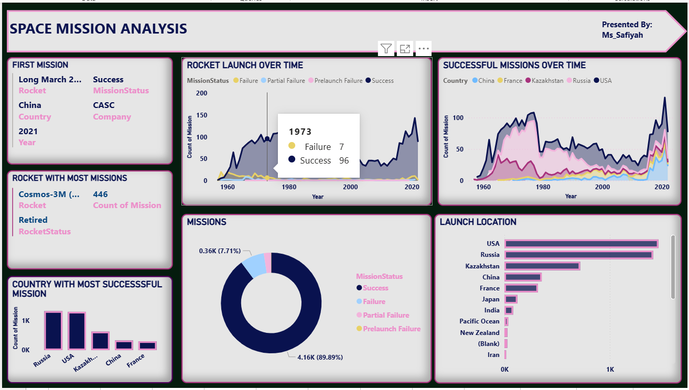

# 🚀 Space Mission Analysis Dashboard (Power BI)

## Project Overview

This project analyzes global space missions using an interactive **Power BI dashboard** to uncover trends in rocket launches, mission success rates, and country-level space activity.

The goal of the analysis is to understand patterns in historical space missions and answer key questions such as:

- How have rocket launches evolved over time?
- Which countries conduct the most successful missions?
- Which rockets have been used most frequently?
- Where are most space launches conducted?
- What percentage of missions succeed or fail?

The dashboard transforms historical mission data into visual insights that highlight the development and competitiveness of the global space industry.

---

# 🛠 Tools Used

- **Power BI**
- Data visualization
- Data transformation
- Analytical storytelling
---

# 🧠 Skills Demonstrated

This project demonstrates several **Power BI and data analysis skills**, including:

- Data cleaning and preparation
- Interactive dashboard design
- Data visualization best practices
- Time-series analysis
- Comparative analysis across countries
- Insight generation from historical datasets

## 🛠️ Data Transformation (The ETL Process)
The raw dataset required significant preparation before it could be used for visualization. Below is a comparison of the data **before** and **after** the cleaning process in Power Query.

### 🔍 Data Cleaning: Before vs. After
**Before Cleaning**
[Before Cleaning](Screenshot 2026-02-22 112606.png)
**After Cleaning** 
[After Cleaning](Screenshot 2026-02-22 112635.png)

**Key Challenges & Solutions:**
* **Messy Location Strings:** Launch sites were stored as single strings (Site, Base, State, Country). I used **Split Column by Delimiter** in Power Query to isolate the **Country** for geographical analysis.
* **Invalid Date Formats:** Raw dates were stored as serial integers (e.g., 21097). I transformed these into a standard **DD/MM/YYYY** format to enable time-series trends.
* **Time Serialization:** Mission times were recorded as decimal values (e.g., 0.811). I converted these into a proper **HH:MM** time format (19:28).
* **Data Imputation:** Standardized the `Price` column by handling null values and converting them to a currency data type to maintain model integrity.

---

# 📊 Dashboard Features
The dashboard contains several visualizations that explore different aspects of space missions.
### 

### 1️⃣ Rocket Launch Over Time

This line chart tracks the **number of rocket launches per year**, categorized by mission outcome:

- Success  
- Failure  
- Partial Failure  
- Prelaunch Failure  

#### Analysis

The visualization shows how rocket launches have increased significantly over the decades.

#### Insights

- Rocket launches increased steadily from the **1960s during the space race**.
- Launch activity declined slightly after the Cold War period.
- In recent years, launch frequency has increased again due to **renewed global space activity and private space companies**.
- The majority of missions result in **successful launches**, indicating improved technology and mission reliability.

---

### 2️⃣ Successful Missions Over Time by Country

This area chart compares **successful missions across major spacefaring nations**.

Countries included:

- USA  
- Russia  
- China  
- France  
- Kazakhstan  

#### Analysis

The chart shows how mission success has evolved by country over time.

#### Insights

- The **USA and Russia dominate the early years of space exploration**.
- China shows **strong growth in successful missions in more recent years**.
- France and Kazakhstan contribute fewer missions but still maintain active participation in global launches.
- The growth of successful launches suggests **continuous technological advancement in the space industry**.

---

### 3️⃣ Rocket With the Most Missions

This visual highlights the rocket that has been used for the **largest number of missions**.

#### Key Finding

- **Cosmos-3M** recorded the highest number of missions (**446 launches**).

#### Insight

- The frequent use of this rocket suggests **high reliability and long-term operational use**.

---

### 4️⃣ Country With the Most Successful Missions

This bar chart compares the **number of successful missions by country**.

#### Insights

- **Russia and the USA lead global space missions**, reflecting their long history in space exploration.
- Kazakhstan appears prominently.
- China has grown rapidly in recent decades.

---

### 5️⃣ Mission Outcome Distribution

This donut chart shows the **percentage distribution of mission outcomes**.

Mission categories include:

- Success  
- Failure  
- Partial Failure  
- Prelaunch Failure  

#### Insights

- Approximately **89.9% of missions are successful**, indicating high reliability in modern space missions.
- Failures represent a **small but important portion**, reflecting the risks involved in space exploration.
- Partial failures and prelaunch failures occur less frequently but still contribute to operational challenges.

---

### 6️⃣ Launch Locations

This bar chart shows the **number of launches by location**.

#### Insights

- The **USA and Russia host the largest number of launch sites**.
- Kazakhstan is also a major launch hub due to the **Baikonur Cosmodrome**, one of the world's most historic launch facilities.
- Other countries such as China, France, and Japan also contribute to global launch activity.

---

# 📈 Key Takeaways

From the analysis, several patterns emerge:

- The **space industry has grown significantly over time**, especially after the early space race period.
- **Mission success rates are very high**, reflecting improved engineering and testing processes.
- The **USA, Russia, and China dominate global space missions**.
- Some rockets have achieved **long operational lifespans and high launch counts**, demonstrating reliability.
- Global interest in space exploration continues to grow, driven by both **government agencies and private companies**.

---

# 👩‍💻 Author

**Ms_Safiyah**
Data analysis project created using **Power BI** to explore historical space mission data and visualize global space activity.

---

Success Rate = 
DIVIDE(
    CALCULATE(COUNTROWS('Space Missions'), 'Space Missions'[MissionStatus] = "Success"),
    COUNTROWS('Space Missions'),
    0
)
